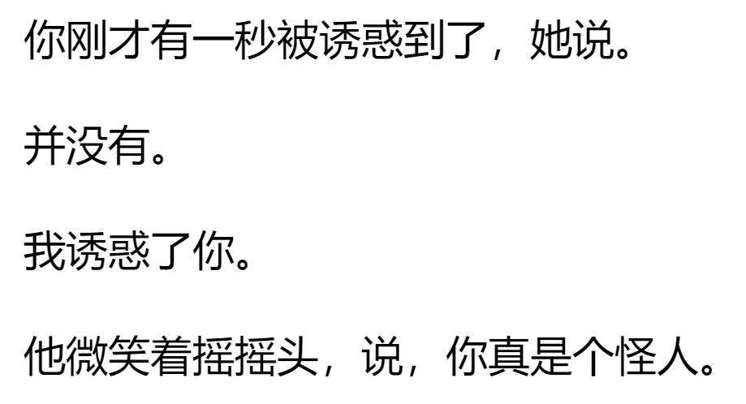

title:: 书架/正常人
2022-03-22 Tuesday

	- > 康奈尔认为这才是他们传那个故事的目的，以**借机盯着一件他们没法窥视的东西看**。
		- 我会觉得自我的一些滑稽，一些做作或者矫情的做法，就是想要捕获一些注意。
		  或者说，想要**看到/得到**一些**无法窥视的东西**
	- > 玛丽安觉得**她真正的人生正在很遥远的地方发生**，在她缺席的情况下发生，她不知道自己能否有一天找到它，成为它的一部分。
	- > 玛丽安意识到她多么希望看见他和谁做爱，**那个谁不一定是她**，任何人都可以。**光是看他就是一种享受**。她知道就是这种想法让她和学校里的人格格不入，让她成为一个怪人。
	- {:height 625, :width 200}
	- > 他感觉自己实际上是两个人，很快他就必须**选择其中一种作为全职，把另外那种抛在身后**。
		- 生活啊，就是这样的==残酷==不是？
	-